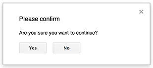
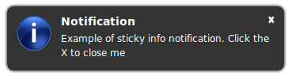
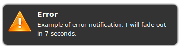
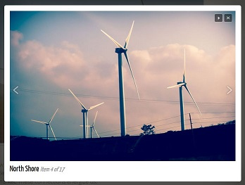
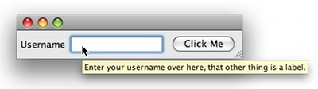

# CSS 命名之Dialog, Modal, Popup, Popover, Lightbox 等的区别

## Alert

一般用于需要立即关注处理的警示信息（警示信息要言简意赅），一般伴有“确定”与“取消”的按钮。警示的窗体通常是前置在当前用户界面，使得用户不能忽视之而必须立即做出响应。

## Modal/Dialog

一般用于通过点击或其它动作后产生的二次操作，操作的窗体就是Modal 或 Dialog。Modal 或 Dialog 主要用于那些不必时时刻刻显示在主界面上，在一定情况下才展示的信息（包括操作本身），通常伴有遮罩层且用户点击空白处（或者关闭按钮——如果有的话）即可消失。

## Popup

一般用于展示一些不需要立即处理的信息。但Popup 一般不会自动消失，需要手动关闭，手动关闭的行为表示你已经看到并知晓信息了（跟“勾选表示我已经阅读”的意思差不多）。

## Flash Notice/Growl Notification

一般用于那些限时提示的信息，这个“限时”并不意味着“紧急”，只是说信息是静静地展示在那里，你不看也没关系，一般几秒钟后便会自动消失。

## Lightbox/Theatres

用于放大并聚焦页面中的某一部分信息，常常用于图片的放大展示中。这种情况下通常是伴有多张图片（相册集）且含有左右切换导航按钮，使得用户不必一张张点击图片缩略图来查看。

## Popover/Tooltip/Hovercard

用于对于页面上某个元素展示额外的信息。常常用来添加额外的说明或提示，或者在用户进行某些动作予以预告形式的提醒（比如“点击这个链接会发生什么”的情景）。

