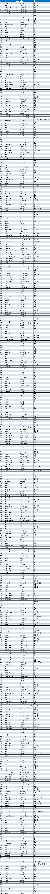

# 开发中常用的单词

## 初级单词

### 第一节

```
void：[vɔid] 空的

main：[mein] 主要的

class：[klɑ:s] 类

system：['sistəm] 系统

out：[aut] 出，外，输出

print：[print ] 打印

public['pʌblik] 公共的,公用的

static['stætik] 静的;静态的;静止的

oracle: [ˈɔ:rəkl] 甲骨文公司

eclipse：[i'klips] java编程软件
```

### 第二节

```
int：[int] 整型

char：[tʃɑ:] 字符型

scanner：['skænə] 接收输入，扫描器

integer：['intidʒə] 整数 整型

type：[taip] 类型

string：[striŋ] 字符串类型

double：['dʌbl] 双精度浮点型
```

### 第三节

```
boolean：['bu:li:ən] 布尔类型真假二值

true：[tru:] 真

false：[fɔ:ls] 假 不正确的

if：[if] 如果

else：[els] 否则

break：[brek] 打破，跳出
```

### 第四节

```
case：[keis] 情况,实例

default：[di'fɔ:lt] 默认

switch：[switʃ] 开关，切换

break：[breik] 退出

match：[mætʃ] 匹配

exception：[ik'sepʃən] 异常

equals：['i:kwəls] 相等
```

### 第五节

```
while：[hwail] 当什么时候，常作循环

index：['indeks] 索引

bug：[bʌg] 缺陷

debug：[di:'bʌg] 调试

step：[step] 步骤

error：['erə] 错误

answer：['ɑ:nsə] 答案 回答
```

### 第六节

```
rate：[reit] 比率

young：[jʌŋ] 年轻的

customer：['kʌstəmə] 顾客 买主

birthday：['bə:θdei] 生日

point：[pɔint] 分数 得分 点

continue：[kən'tinju:] 继续、进入到下一个循环

return：[ri'tə:n] 返回

total：['təutl] 合计、总人数,,全体的
```

### 第七节

```
array：[ə'rei] 数组

length：[leŋθ] 长度

sort：[sɔ:t] 分组 排序

primitive：['primitiv] 初始的 简单的

reference：['refərəns] 参照 证明 关系

info：['infəu] 通知 报告 消息

interface：['intəfeis] 接口
```

### 第八节

```
random：['rændəm] 随机

insert：[in'sə:t] 插入 嵌入

compare：[kəm'pɛə] 比较 对照

ignore：[ig'nɔ:] 忽视 不理会

invert：[in'və:t] 使转位 倒转

password：['pɑ:swə:d] 密码 口令
```

### 第九节

```
bit：[bɪt] 位,0或1

byte:[baɪt] 字节，8个bit

put:[pʊt] 放

log:[lɔ:g] 日志

show:[ʃoʊ] 展示，显示
```

### 第十节

```
change：[tʃeindʒ] 交换 互换

administrator：[əd'ministreitə] 管理员

initial：[i'niʃəl] 开始的、最初的

class：[klɑ:s] 类

object：['ɔbdʒikt] 物体 对象

encapsulation：[in,kæpsju'leiʃən] 封装

null：[nʌl] 空的
```

### 第十一节

```
person：['pə:sn] 人

start：[stɑ:t] 开始

menu：['menju:] 菜单

login：[lɔg'in] 登陆

main：[mein] 主要的

document：['dɔkjumənt] 文档

display：[di'splei] 显示

method：['meθəd] 方法 条理

version：['və:ʃən] 版本

parameter：[pə'ræmitɚ] 参数

since：[sins] 自…..之后

calculator：['kælkju,leitə] 计算器
```

### 第十二节

```
shape：[ʃeip] 形状

open：[əup] 打开

date：[deit] 日期

operate：['ɔpə,reitə] 操作

protect：[prə'tekt] 保卫 护卫

private：['praivit] 私人的 私有的
```

### 第十三节

```
manage：['mænidʒ] 控制，管理

search：[sə:tʃ] 搜寻 查找

upper：['ʌpə] 上面的
```

### 第十四节

```
equal：['i:kwəl] 相等的

ignore：[ig'nɔ:] 忽视 驳回

lower：['ləuə] 较低的 下部的

last：[lɑ:st] 最后的

trim：[trim] 裁切

concatenate：[kɔn'kætineit] 使连锁 连成一串 使连接

buffer：['bʌfə] 缓冲

final：['fainl] 最后的 最终的
```

### 第十五节

定义变量中常用的单词

```
score：[skɔ:] 成绩

price：[prais] 价钱

test：[test] 实验，测试

demo：['deməu] 示例

sum：[sʌm] 和

num：[nʌm] 数字

height：[hait] 身高

weight ：[weit] 体重

music：['mju:zik] 音乐

computer：[kəm'pju:tə] 电脑

student：['stju:dənt] 学生

total：['təutl] 总计的,总括的,全体的
```

### 第十六节

```
max 最大的

min 最小的

avg 平均分

add 加

minus 减

multiply：['mʌltiplai] 乘

divide：[di'vaid] 除

Monday：['mʌndei] 星期一

Tuesday：['tju:zdi] 星期二

Wednesday：['wenzdi] 星期三

Thursday：['θə:zdi] 星期四

Friday：['fraidi] 星期五

Saturday：['sætədi] 星期六

Sunday：['sʌndi] 星期日
```

月份+缩写

```
一月：January Jan.

二月：February Feb.

三月：March Mar.

四月：April Apr.

五月：May –

六月：June –

七月：July –

八月：August Aug.

九月：September Sept.

十月：October Oct.

十一月：November Nov.

十二月：December Dec.
```

## 高级部分


